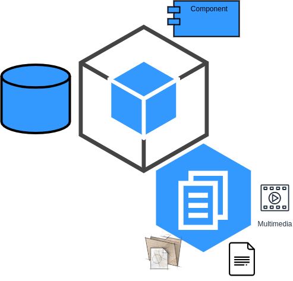
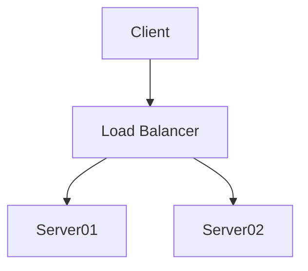

# About documentation

## Docs in software
- What is it?
```
(know him, Handle it) = set_of_elements(manuals, guides, videos, diagrams, Kwargs**)
```


- Documentation as code

    Docmentación como codigo
        deja de ser engorrosa, libros empolbandose en el internet
        mas dinamica, mas rapida, mas entretenida

- Influences quality

    More quality

- It is part of the project

    La documentación  nos une a la comunidad por lo que es la cara de un proyecto, 
    no es un tema aparte es parte del proyecto, 
    el software habla por si solo
    pasamos 70% del tiempo leyendo

## How to Write Good Documentation


## Read the docs

